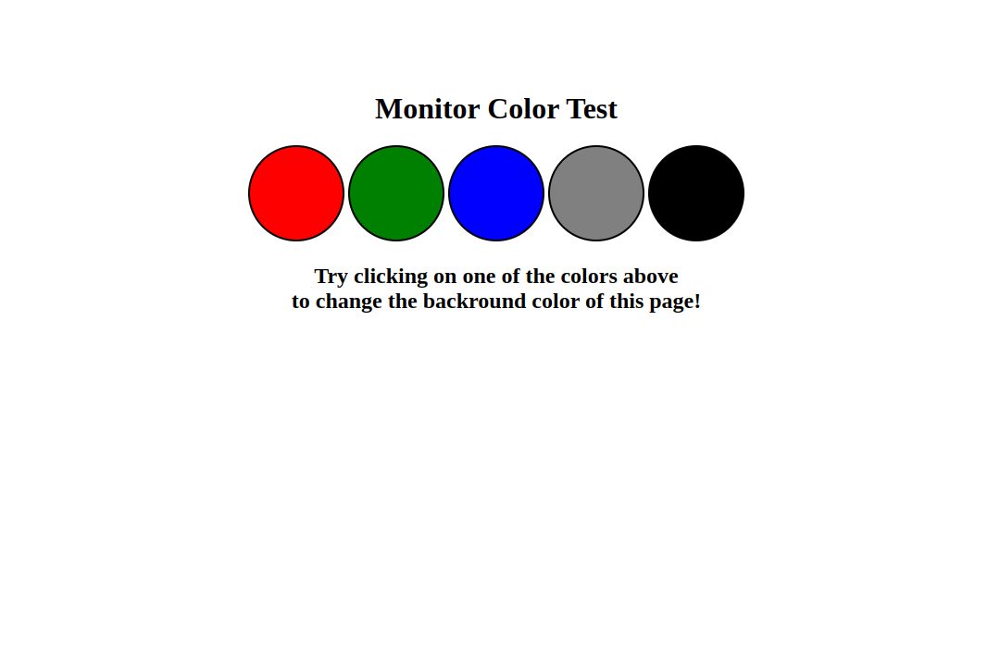

# MonitorColorTest

Monitor Color Test is a web-based tool designed to help you check your monitor's display and detect any dead pixels on the screen. This project utilizes HTML, CSS, and JavaScript, with a focus on clean and readable code by utilizing forEach loops and if conditions.

## Tech Stack

**Client:** HTML, CSS, JavaScript

## Usage/Examples

Once the web page loads, you will see the five circle buttons representing different colors. 

#### Follow these steps to test your monitor:

Open the [Link](https://himubey.github.io/MonitorColorTest/) in your web browser.
Click on each circle button to change the background color of the screen.
Carefully observe the display for any dead pixels or irregularities.
Repeat the process with different circle buttons to thoroughly test your monitor.

## Screenshots

## Features

The Monitor Color Test project provides an easy-to-use tool for evaluating your monitor's display quality and detecting dead pixels. We hope you find it beneficial for maintaining optimal visual performance. If you have any questions or suggestions, please don't hesitate to reach out.

Happy testing!
## License

[MIT](https://choosealicense.com/licenses/mit/)

